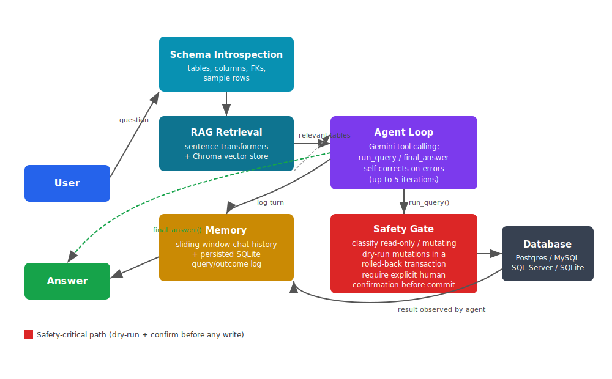

# SQL Co-Pilot

An agentic, schema-aware SQL assistant. You ask questions in plain English, it retrieves the relevant parts of your database schema, decides what queries to run, executes them, and reports back — while a dedicated safety gate makes sure nothing mutates your data without your explicit say-so.

Built to work across Postgres, MySQL, SQL Server, and SQLite through a single connection layer.



## Why this exists

Most "natural language to SQL" demos stop at single-shot query generation: you ask a question, get a query back, and hope it's right. SQL Co-Pilot is a real agent loop — it can run a query, look at the result (or the error), and try again before answering, the same way a person would debug a query interactively. On top of that, it never assumes a generated query is safe to run; every mutating statement goes through a validation step before a human ever sees a confirmation prompt.

## How it works

1. **Schema introspection** pulls full table, column, and foreign-key metadata (plus sample rows) from the connected database.
2. **RAG retrieval** embeds each table as a text chunk locally (`sentence-transformers`) and stores it in a Chroma vector store, so only the tables relevant to a given question are sent to the model — not the entire schema on every call.
3. **Agent loop** hands the question and retrieved schema to Gemini, which can call `run_query` to execute SQL and observe results, or `final_answer` once it has enough information. If a query errors, the agent sees the error and corrects itself, up to 5 iterations.
4. **Safety gate** classifies every query as read-only or mutating. Read-only queries run immediately. Mutating queries are first dry-run inside a transaction that's always rolled back, proving the query is valid without touching real data — only after that, and only with explicit confirmation, does anything commit.
5. **Memory** keeps a sliding window of the current chat session (so follow-up questions like "which one spent more" resolve correctly) and persists every query attempt — question, SQL, success/failure, and result — to a local SQLite audit log.

## Safety model

This is the part worth reading closely if you're evaluating the project rather than just running it.

- **Classification before execution.** Every SQL string is parsed and classified as `read_only`, `mutating`, or `unknown`. Anything the classifier can't confidently place is treated as unsafe by default.
- **Dry-run validation.** Mutating queries are executed inside a database transaction that is *always* rolled back, regardless of outcome. This proves the query is syntactically and semantically valid against the real schema without ever committing a change.
- **Human-in-the-loop confirmation.** Only after a successful dry run is the user shown the exact SQL and asked to explicitly confirm. Declining means nothing happens — verified in testing, including via the agent loop itself.
- **Audit log.** Every query attempt, whether it succeeded, failed, or was declined, is written to a persisted SQLite log with a timestamp, so there's always a record of what the agent tried to do.

The goal is that an LLM never has unsupervised write access to a real database — it can propose, validate, and explain, but a human always has the final say on anything destructive.

## Quickstart

```bash
git clone https://github.com/Vrindakr3300/sql-copilot.git
cd sql-copilot
poetry install
poetry run sql-copilot setup-demo
poetry run sql-copilot chat
```

Try asking:

```
who are my customers
who spent the most
```

You'll need a `GEMINI_API_KEY` in a `.env` file at the repo root.

## Connecting to a real database

`db.py` supports Postgres, MySQL, and SQL Server via SQLAlchemy connection strings — point `ConnectionConfig` at your instance instead of the bundled SQLite demo to run the same agent against a real schema.

## Demo


*(record a short terminal session: `who are my customers` → `who spent the most` → a mutating query showing the confirmation panel, then drop the GIF in `docs/demo.gif`)*

## Tech stack

- **SQLAlchemy** — unified database connectivity
- **sentence-transformers + Chroma** — local embeddings and vector retrieval for schema RAG
- **Google Gemini** — agentic tool-calling for query generation and self-correction
- **sqlparse** — SQL statement classification for the safety gate
- **Typer + Rich** — CLI and terminal UI
- **SQLite** — local memory and audit log persistence

## Project status

Core agent (schema → retrieval → tool-calling loop → safety gate → memory) is complete and tested end-to-end against a local SQLite demo. Multi-database testing against live Postgres/MySQL/SQL Server instances (via Docker) is a planned next step.
